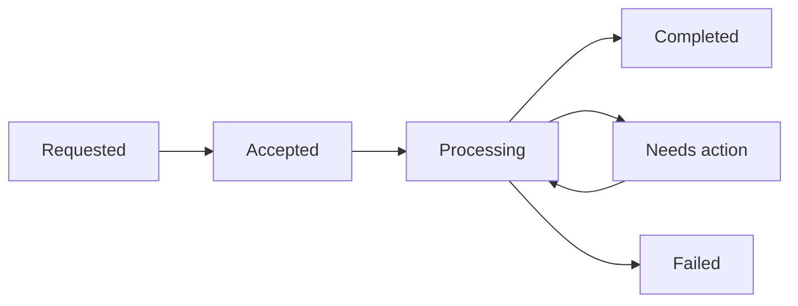

# Core resources and lifecycle

Partners should not have to reverse-engineer the platform from endpoint names. Start with the business workflow.

## Suggested pattern

1. Introduce the main business object
2. Show its lifecycle states
3. Link the actions or endpoints that move it forward
4. Explain how asynchronous updates are delivered

## What to make explicit

- state transitions partners control
- state transitions OEC controls
- retry or replay behavior
- which fields are stable identifiers versus transient metadata
